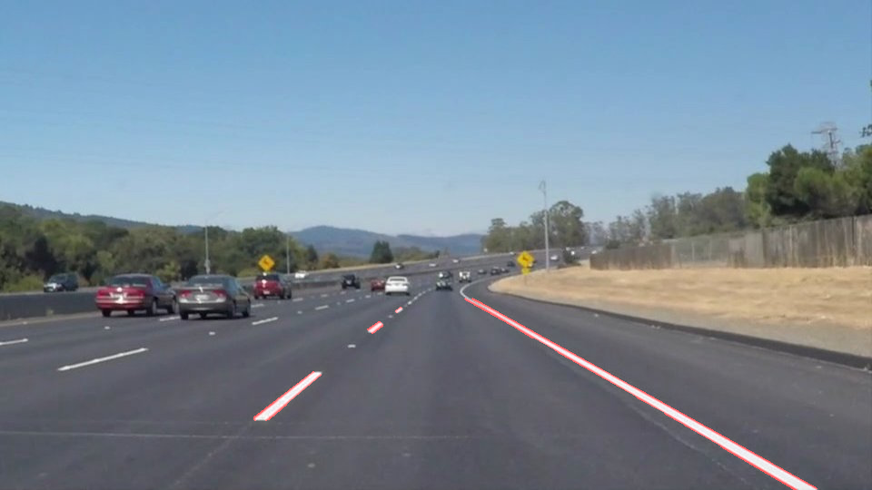

# **Finding Lane Lines on the Road** 

## Writeup 

---

**Finding Lane Lines on the Road**

The goals / steps of this project are the following:
* Make a pipeline that finds lane lines on the road
* Reflect on your work in a written report

[//]: # (Image References)

[image1]: ./examples/grayscale.jpg "Grayscale"

---

### Reflection

### 1. Describe your pipeline. As part of the description, explain how you modified the draw_lines() function.

As a first version, I designed the pipeline like we could see in quizzes of the Computer vision lessons : 

- It takes an image or an image filename as an input, read the image.

- Transform input image into gray image. (named "gray")

- Apply Gaussian blur to reduce image noise. (output is "blur_gray" image)
- Run gray image through openCV Canny Edge Detection (output is "edges" image)

- Run Canny Edge Detection image through 4 side polygon Mask to only retain edges in our Region of Interest and so discard the other regions to detect lanes. (output is "masked_edges" image)

- Run this Edge Masked image through hough Transform to filter to select/filter line segments we would like to highlight/retain in the image. That's were continuous or discontinuous lane lines segments are showed and colorized. (output is "line_img")

- Merge original image with "line_img" to result in "lines_edge" image, showing original image with lane borders colorized and overlayed.

- At the end, save the output image into different files.

Each step could be covered by specific helper functions provided in this project so I made full use of them.

Second version/evolution consisted to extrapolate continuous or discontinuous segment of one left and one right lane, into longer lane lines. For this purpose, mainly the helper function draw_lines() needs to be modified, in the following way : 

- draw_lines() function is called by hough_lines() to draw line segments detected by Houth Transformation
- Those line segments are represented by a pair of coordinates (x,y) representing extremeties of each lines.
- Idea is to list all those coordinates together, which would ideally belong to the same right or left lane, and extrapolate a longer lane going from bottom of image up to a certain vertical level of the image.
- Way to separate line segments between left or righ lane is by calculating slope of each segments. If slope < 0, store (x,y) in left coordinate list. If slope > 0, store coordinates in right coordinate list.
- Then for each left and right list of coordinates, run those lists through np.polyfit() function which will interpolate a line y=mx+b interpolating a virtual line trying to run as close as possible through those coordinate list.
- This is giving us 2 line equations, one for left lane, one for right lane.
- Given we know 2 extremities y coordinates for each left/right lanes (y1 = height of image, y2 = height of top lane extremity we want to draw), we can then find the x coordinates using the 2 left/right y=mx+b equations.
- And then we have necessary coordinates to use openCV drawing function to draw extrapolated left and right lanes from image bottom to a certain vertical position in the picture.

- We then follow the previous pipeline which will combine the 2 pictures and overlay the extrapolated lanes.

Note : 
- My code includes several file save primitives to save image snapshots on main steps for write-up illustrations as shown above. 
- Example showed for one specific image, but you can find similar for all the other example images provided in this project, spread over output subfolders.

### 2. Identify potential shortcomings with your current pipeline

Here are few shortcomings I can think about with my current pipeline : 

1. Red color of the edge detected lines and lanes seem very faded/weak compared to examples given for this project. This may be due to white lines in original image or around those numbers, are merged and overlayed by the Red lines given by the Canny Edge Detection / Hough Transform pipeline. I suspect that to get darker reds, I would have to modify pixels from the original image corresponding to the red lines, set them to 0, and therefore the red would appear darker in the output images. No time to work on it.

2. Mask to discard other edge detection lines and only focus and restrict to Lane lines : the polygon mask is chosen quite roughly/manually. This leads to other edges being included in Mask area which do not belong to lanes, and therefore they will parasite/polute the lines segment detection and Lane drawing. It could be improved by having a first pass to detect lanes and then having 2nd pass to adapt the mask according to positions of lanes found in the first pass.

3. For extrapolating Lanes, more rule/algorithm could be applied to slope selections and line segments we take into account to draw lines after the Hough Transform step. Canny Edge detection would detect changes in concrete material, resulting in horizontal lines detection which we'd like to discard in the process of lane extrapolations.

4. Canny Edge detection threshold could be optimized using more images/Machine Learning/training.

5. Same for Hough Transform optimization.

6. Noticed with challenging video some erratic orientations on extrapolates lanes

7. Noted with the challenge video my pipeline was also detecting some side corner / emergency lanes/edges, more optimization may prevent that. This kind of over detection would polute the slope calculation to extrapolate the lane, that would be something to fix.

### 3. Suggest possible improvements to your pipeline

Possible improvements I can think about : 

1. For Lane extrapolation, I used a np.polyfit() of 1 degree only, ie extrapoling lines. We could try to extrapolate longuer lanes with curves using more degrees in the np.plyfit function to handle curves.

2. Fix erratic extrapolate lanes when testing with challenge video.

3. optimize better the Canny Edge / Hough Transform to avoid detecting horizontal edges for Lane lines.
